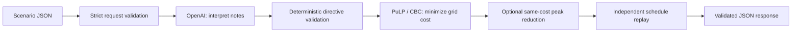

<div align="center">

# GridWise · Smart Campus Energy Optimizer

### Understand the notes. Enforce the rules. Minimize the electricity bill.

[](https://www.python.org/)
[](https://fastapi.tiangolo.com/)
[](https://developers.openai.com/api/)
[](https://coin-or.github.io/pulp/)
[](https://www.docker.com/)

**BUP CSE Fest 2026 Preliminary Round — Smart Campus Energy Optimization Challenge**

</div>

A FastAPI service for the **BUP CSE Fest 2026 Smart Campus Energy Optimization Challenge**. The configured OpenAI model interprets operator notes, deterministic guardrails validate the result, PuLP/CBC minimizes 24-hour grid cost, and an independent validator replays the final schedule before it is returned.

## Team

### The Mergers

| # | Member | Role |
|---:|---|---|
| 1 | Tanvir Ahmed Siddique | Member |
| 2 | Emtiaz Ahmed Siam | Member |
| 3 | Md Mushfique Hussain | Member |
| 4 | Taskin Billah Tamim | Team Lead |

## At a glance

| Evidence | Verified result |
|---|---|
| Full test suite | **243 passed** on Windows and **243 passed** inside Linux |
| Official sample costs | **10/10 optimal**, zero BDT gap within tolerance |
| Candidate 1.0.1, real LLM over Docker HTTP | **30/30**, p95 **2.673 s**, cache disabled |
| Hosted 1.0.0, real LLM | **30/30**, p95 **2.642 s**, cache disabled |
| Concurrent candidate requests | **10/10** with up to 8 active requests |
| Language robustness audit | Terra/none, Terra/low and Sol/low each **56/56** on the tested set |
| Tie-break video | **2:38**, 1080p H.264/AAC, visually and playback verified |

Results were recorded on 18 September 2026. They are evidence from public and supplemental tests, not a claim about hidden-test scores or uninterrupted hosting.

**Contents:** [Project links](#project-links-and-versions) · [Quickstart](#clean-local-quickstart) · [Architecture](#where-the-llm-is-needed-step-by-step) · [API](#api-contract) · [Configuration](#configuration) · [Testing](#testing-and-performance) · [Docker](#docker-and-deployment) · [Rubric](#rubric-and-main-problem-coverage) · [Limitations](#dependencies-attribution-and-limitations)

## Project highlights

- **Real language interpretation:** one OpenAI request extracts the meaning of all 1–3 operator notes, including relevant constraints and irrelevant notes.
- **Strict guardrails:** exact types, shapes, note order, hour ranges, finite values and capacity checks before constraints reach the solver.
- **Minimum electricity bill:** a linear program solves the specified 24-hour lossless-battery problem; all official sample costs match the organizer optimum.
- **Lower peak at the same bill:** candidate 1.0.1 reduces peak import among equally cheap schedules, without trading away the primary cost objective.
- **Independent verification:** a separate schedule replay checks physical rules and recalculates totals; independent dynamic-programming tests check optimizer quality.
- **Reproducible delivery:** pinned dependencies, non-root Docker images, anonymous registry pulls, executable official-sample tests and recorded benchmark evidence.

## Why this solution stands out

Version 1.0.1 preserves the minimum electricity bill and then minimizes peak grid import among equally cheap schedules. SAMPLE-01 improves from **187.5 to 175 kWh** and SAMPLE-09 from **187 to 170 kWh**, with no increase in cost. A bounded transient-provider retry improves reliability, while independent replay and dynamic-programming comparisons provide evidence beyond ordinary unit tests.

The LLM is used only where the challenge requires language understanding. It cannot calculate or alter the final schedule, bill, battery trajectory, or reported totals. See the [criterion-by-criterion audit](docs/JUDGE_AUDIT.md), [candidate evidence](docs/audit-verification.json), and [release instructions](docs/RELEASE_1_0_1.md).

## Project links and versions

| Resource | Link / status |
|---|---|
| Hosted API | [Render base URL](https://bup-cse-preliminary-round-1-0-0.onrender.com) — use the endpoints below; `/` is not an application page |
| Readiness | [GET /health](https://bup-cse-preliminary-round-1-0-0.onrender.com/health) |
| **Live Demo** | [Interactive Swagger UI](https://bup-cse-preliminary-round-1-0-0.onrender.com/docs) |
| Optimization | `POST https://bup-cse-preliminary-round-1-0-0.onrender.com/optimize-energy` |
| Source | [Repository](https://github.com/myshphew/BUP-CSE-FEST-2026-Hackathon-preliminary-round) |
| Candidate review | [PR #1](https://github.com/myshphew/BUP-CSE-FEST-2026-Hackathon-preliminary-round/pull/1) |
| Judge audit | [Every scored subcriterion](docs/JUDGE_AUDIT.md) |
| Solution video | [Transcript and reproduction notes](docs/video/README.md) — 2:38 candidate video; organizer-accessible link must be submitted |

| Version | Model / effort / cache | Evidence |
|---|---|---|
| Hosted **1.0.0** | Terra / `none` / `128` | [Public HTTP verification](docs/public-verification.json) |
| Candidate **1.0.1** | Terra / `low` / `128` | Current development branch, local Compose and [published image](docs/RELEASE_1_0_1.md); [candidate verification](docs/audit-verification.json) |
| Source defaults | Astra / `low` / `128` | `config.py` and `.env.example`; the quickstart explicitly selects the tested candidate profile |

No authentication is required for the API endpoints. The hosted service currently runs 1.0.0; candidate 1.0.1 is the reviewed development version and published Docker fallback.

## Official sources and API permission

The [main problem statement](docs/reference/main_prblm-1.pdf) defines behavior and schemas. The [participant guide and rubric](docs/reference/BUP_CSE_FEST_2026_Participant_Guide__Evaluation_Rubric_GridWise_LLM.pdf) defines scoring, deployment, and submission. The guide, section 04, page 5 explicitly permits **external model APIs or local models**, so OpenAI is allowed. It requires the language model to produce the operator-note interpretation used by the optimizer; phrase matching alone or an AI-written summary is insufficient.

The service uses the OpenAI **Responses API with Structured Outputs**. Candidate 1.0.1 uses `gpt-5.6-terra` with `low` reasoning; Astra/low remains the source default and hosted 1.0.0 uses Terra/none. Model settings affect language interpretation only. The API account must have model access, quota and suitable rate limits during judging.

The root [official sample pack](BUP_CSE_FEST_2026_Preli_Public_Sample_Cases.json) is a byte-for-byte copy of the supplied organizer file, with 10 cases under `cases`. Each contains `input`, `expected_output`, and supporting metadata. Its SHA-256 is:

```text
fa6abd71868e0faf429a87429d7d4a2b7bfd38c5551565637498d7fec68d5f32
```

The service never loads reference interpretations or schedules. They are used only by tests and the explicitly labeled offline evaluation command. Do not edit the official file.

## Clean local quickstart

Install **Python 3.11 or later**; Python 3.12 is the tested version. CBC is included in the pinned PuLP distribution on supported platforms. No database or separate model server is needed.

```bash
git clone --branch codex/render-provider-diagnostics https://github.com/myshphew/BUP-CSE-FEST-2026-Hackathon-preliminary-round.git bup-cse-preliminary-round
cd bup-cse-preliminary-round
python -m venv .venv
```

This branch contains candidate 1.0.1; the default branch may still contain 1.0.0. Until the repository owner enables public access, cloning requires repository access. Activate the environment:

```powershell
# Windows PowerShell; use py -3.12 instead of python above if your default is older.
.\.venv\Scripts\Activate.ps1
```

```bash
# Linux / macOS
source .venv/bin/activate
```

Then install exact runtime versions and development tests:

```bash
python -m pip install -r requirements.lock -r requirements-dev.txt
```

For a fresh checkout, copy `.env.example` to `.env` (`Copy-Item .env.example .env` in PowerShell; `cp .env.example .env` in Bash). Do not overwrite an existing configured `.env`. Enter `OPENAI_API_KEY` in that local file and set the following non-secret candidate values. Keep the key out of source control, screenshots, terminal output, and public submission fields. Other defaults can remain unchanged.

```dotenv
OPENAI_MODEL=gpt-5.6-terra
OPENAI_REASONING_EFFORT=low
INTERPRETATION_CACHE_SIZE=128
PORT=8000
```

If PowerShell blocks activation, use `.\.venv\Scripts\python.exe` instead of `python` in every command below; no execution-policy change is required. Your API account needs access to the chosen model and available quota. No local GPU is required.

```bash
python -m pytest -q
python -m scripts.evaluate_samples --offline
python run.py
```

The launcher binds `0.0.0.0:8000`, or the port supplied by `PORT`. Equivalent explicit command:

```bash
python -m uvicorn main:app --host 0.0.0.0 --port 8000 --no-access-log
```

In another terminal with the virtual environment activated:

```bash
curl http://127.0.0.1:8000/health
python -m scripts.extract_sample --index 1
curl -X POST http://127.0.0.1:8000/optimize-energy -H "Content-Type: application/json" --data-binary "@output/request.json"
python -m scripts.evaluate_samples --url http://127.0.0.1:8000 --limit 1
python -m scripts.evaluate_samples --url http://127.0.0.1:8000 --output output/live-samples.json
```

On Windows use `curl.exe` if PowerShell aliases `curl`. The extraction command copies the first **existing official** input to `output/request.json` and its complete reference response to `output/reference-response.json`; it does not generate scenarios. The ready health response is HTTP 200 with `{"status":"ok"}`. SAMPLE-01 should return HTTP 200, echo `SAMPLE-01`, provide 24 ordered plan rows and have `total_cost_bdt = 38365` within 0.01 BDT. Note 0 is `solar_reduction` at hours `[12,13]` with factor `0.25`; note 1 is `no_op`, `applies=false`, adjustment `null`. The evaluator prints `PASS SAMPLE-01` and `1/1 passed`. Candidate peak refinement produces `175` kWh; exact battery actions may differ between equally optimal solutions. To exercise the public deployment, substitute the Render base URL for localhost.

`/health` verifies that a client is configured and the local solver passed a startup solve. It makes no paid provider call and cannot establish that a key has funded quota or model access. Missing credentials or an unavailable CBC produce controlled HTTP 500 with `service_not_ready`. **A successful full sample request is necessary before declaring a deployment ready for judging.**

## Where the LLM is needed, step by step

1. `main.py` accepts and strictly validates the scenario: 24 distinct hours, 1–3 non-empty notes, finite non-negative numeric values, and consistent battery bounds.
2. `interpreter.py` sends all notes and battery reference values in **one** OpenAI request. It extracts only note indexes, directive types, affected hours, and values. Percentage reserves can use the supplied battery capacity. Notes are user data, never system instructions. The model has no tools, credentials in its prompt, or execution path.
3. `validator.py` validates this compact untrusted extraction, derives `applies` and short explanations deterministically, then revalidates the exact public response shape and scenario-dependent bounds. It rejects unknown types/fields, invalid hours, duplicate or missing note mappings, incorrect `applies` semantics, non-finite numbers, and reserves above capacity. Generating redundant fields in Python reduces model output tokens without removing any semantic checks.
4. `constraints.py` combines overlapping instructions deterministically: multiply solar factors, maximize reserves, minimize grid caps, and zero prohibited charge/discharge limits.
5. `optimizer.py` builds and solves the linear program with CBC. Candidate 1.0.1 optionally fixes that minimum bill and minimizes peak import within the remaining solver budget; if refinement fails, it retains the primary optimum. **All schedules, costs, battery states, and grid totals come from deterministic code.** No LLM call is made here.
6. `schedule_validator.py` independently rebuilds the directive effects and replays each hour. It verifies energy balance, solar usage, battery transitions and bounds, rates, windows, grid caps, final neutrality, and recomputed totals.
7. `main.py` returns the exact response schema and a deterministic summary. Provider or validation failure returns a controlled error; it never substitutes `no_op` or serves a reference answer.



This is a single service with separate responsibilities. See [the mathematical formulation and implementation decisions](docs/ARCHITECTURE.md) and [the rubric mapping](docs/RUBRIC.md).

### Directive shapes and time conventions

Each note maps to one of the following types. Every response entry contains `note_index`, `applies`, `directive_type`, `structured_adjustment` and a short `explanation`.

| Type | Exact adjustment fields | Deterministic effect |
|---|---|---|
| `solar_reduction` | `hours`, `factor` | Scale solar by the remaining fraction in `[0,1]`; an 80% reduction means `0.2` |
| `minimum_battery_reserve` | `hours`, `minimum_energy_kwh` | Enforce the reserve **after** each affected hour; it cannot exceed capacity |
| `no_charge_window` | `hours` | Charge amount is zero |
| `no_discharge_window` | `hours` | Discharge amount is zero |
| `max_grid_window` | `hours`, `max_grid_kwh` | Bound hourly grid import |
| `no_op` | `null` | No change; the only type with `applies=false` |

All other types use `applies=true`. Adjustment hours are unique sorted integers `0..23`. Start is included and end excluded: 1 PM–3 PM maps to `[13,14]`. Values must be finite and within their specified non-negative bounds. Overlaps multiply solar factors, maximize reserves, minimize caps and enforce all charge/discharge restrictions.

### Physical rules and electricity objective

```text
grid + solar_used + battery_discharge = demand + battery_charge
energy_after = energy_before + battery_charge - battery_discharge
base/active reserve <= energy_after <= capacity
0 <= solar_used <= effective solar
final battery energy = initial battery energy
minimize sum(grid_kwh[h] * tariff_bdt_per_kwh[h], h=0..23)
```

Charge/discharge obey their hourly rate limits. One signed flow maps to one `charge`, `discharge` or `idle` action; idle magnitude is zero. Unused solar may be curtailed; grid export is prohibited. All returned energies are finite and non-negative. Terminal neutrality prevents treating starting battery energy as a free source. The optional peak stage fixes the minimum bill rather than using a weighted objective; its cost-preservation check is 0.001 BDT, tighter than the judge's 0.01 tolerance.

## API contract

| Request field | Required content |
|---|---|
| `scenario_id` | Non-empty string, echoed unchanged |
| `operator_notes` | 1–3 non-empty strings |
| `hours` | Exactly 24 entries, each with `hour`, `demand_kwh`, `solar_kwh`, `tariff_bdt_per_kwh` |
| `battery` | `capacity_kwh`, `initial_energy_kwh`, `minimum_energy_kwh`, `max_charge_kwh_per_hour`, `max_discharge_kwh_per_hour` |

Numeric inputs are finite and non-negative; battery bounds satisfy `minimum <= initial <= capacity`. Every plan row contains `hour`, `grid_kwh`, `solar_used_kwh`, `battery_action`, `battery_kwh`, `battery_energy_after_kwh`. Battery actions are exactly `charge`, `discharge`, or `idle`. Total grid is the sum of hourly imports and peak is their maximum.

- `GET /health`: HTTP 200 with `{"status":"ok"}` when configured and the solver is usable.
- `POST /optimize-energy`: one scenario object, exactly as `cases[i].input` in the official JSON. Do not send the whole sample pack or the case wrapper.
- Success: HTTP 200 with `scenario_id`, `directive_interpretation`, `hourly_plan`, `total_grid_kwh`, `total_cost_bdt`, `peak_grid_kwh`, and `plan_summary`.
- Malformed JSON or an invalid request: HTTP 400. Extra fields and strings/booleans in numeric fields are rejected. Input hours may arrive out of order; responses are always ordered 0–23.
- Infeasible validated constraints: HTTP 422. Feasible organizer scoring cases should never need this path under their correct interpretation.
- Model refusal, incomplete/malformed model output, upstream failure, solver failure, timeout, or failed replay: controlled HTTP 500. Error bodies contain only a fixed code/message, for example `{"error":{"code":"model_unavailable","message":"The language model is unavailable. Please retry later."}}`.

Interactive schema documentation is available at `/docs`. Absolute verification tolerance is **0.01 kWh / 0.01 BDT**, as specified. Required response numeric values remain finite and non-negative; totals are recomputed from the returned flows without rounding to display precision.

## Configuration

| Variable | Default | Purpose |
|---|---|---|
| `OPENAI_API_KEY` | required | Secret for the hosted API; never committed |
| `OPENAI_MODEL` | `gpt-6-astra` | Source baseline; candidate quickstart explicitly selects measured `gpt-5.6-terra` |
| `OPENAI_REASONING_EFFORT` | `low` | Astra: low, medium, high, xhigh, max. Sol/Terra also support `none`; Astra with `none` is rejected locally |
| `OPENAI_TIMEOUT_SECONDS` | `20` | Hard wall-clock deadline around the model call |
| `OPENAI_MAX_OUTPUT_TOKENS` | `2048` | Budget for the short structured response, including reasoning |
| `REQUEST_TIMEOUT_SECONDS` | `28` | Request processing deadline, including semaphore queue time; must be below 30 |
| `SOLVER_TIMEOUT_SECONDS` | `3` | Shared primary/secondary CBC budget; only proven-optimal results are accepted |
| `MAX_CONCURRENT_REQUESTS` | `8` | Maximum active interpretation/optimization pipelines per worker |
| `INTERPRETATION_CACHE_SIZE` | `128` | Bounded cache of successful validated model responses; `0` disables it |
| `PORT` | `8000` | Port used by `python run.py` and Docker |

Environment variables take precedence over `.env`; restart after changing either. OpenAI requests use `store=false`. One bounded retry handles selected transient connection/rate/server errors within the original deadline; credential, quota, timeout, refusal and malformed-output failures remain controlled errors.

Use cache `128` normally and `0` for an uncached benchmark. Only successful validated model results are cached, every hit is revalidated, and simultaneous identical misses share one model request. The cache is not a lookup table of organizer answers and cannot accelerate a new note.

## Testing and performance

```bash
python -m pytest -q
python -m scripts.evaluate_samples --offline --output output/offline-samples.json
python tests/live_http_smoke.py
python -m pip check
```

Offline evaluation tests math using organizer interpretations. The socket smoke test uses a **test-only interpreter** and also checks missing-key behavior. Neither command measures actual language understanding; production always uses the OpenAI interpreter.

For actual LLM accuracy and latency, configure the key, run the production app, disable the interpretation cache for a cold-request benchmark, and run:

```bash
python -m scripts.evaluate_samples --url http://127.0.0.1:8000 --repeat 3 --output output/live-benchmark.json
```

The runner checks semantics, replays schedules under **organizer ground truth**, recalculates cost and reports nearest-rank p95. The guide requires each request within 30 seconds and gives full latency credit at p95 ≤5 seconds. Restore cache `128` and restart after benchmarking.

Recorded candidate evidence: **243 tests on each of Windows and Linux**, **30/30** uncached Docker HTTP requests (p95 **2.673 s**, maximum **2.774 s**), and **10/10** concurrent real-model requests with up to eight active (maximum **2.952 s**). Terra/none, Terra/low and Sol/low each passed **56/56** language audit requests; selected Terra/low additionally passed **9/9** semantic edge variants. These finite measurements do not guarantee unseen-note accuracy or cold-host latency. [Machine-readable evidence](docs/audit-verification.json).

Supplemental model comparisons cover paraphrases and prompt injection with real uncached calls. Other tests cover invalid inputs, overlaps, numeric edge cases, infeasibility, independent cost checks, provider failures, corrupted schedules, determinism, caching and concurrency. Test variants never alter the official pack. [Detailed performance evidence](docs/PERFORMANCE.md).

## Docker and deployment

The verified Linux/amd64 image uses Python 3.12, pinned dependencies, an unprivileged user (UID 10001), a health check and port 8000. Secrets are excluded from the build context. With `.env` configured, manage the local service using:

```bash
docker compose up -d --build --wait
docker compose ps
curl http://127.0.0.1:8000/health
docker compose logs --tail 30
docker compose down
```

Compose uses `.env`, bounded log rotation and `restart: unless-stopped`. Docker Desktop must be running. After configuration changes use `docker compose up -d --force-recreate --wait`. If port 8000 is occupied, set `HOST_PORT=8001` before starting. [Windows troubleshooting](docs/DOCKER_WINDOWS.md).

### Exact published candidate fallback (version 1.0.1)

The candidate image is published and anonymously pullable; it has not replaced the hosted service. Source commit: `54a8b1d5edda0504c74f62b21305d5b1173c9227`; later branch commits include documentation. From a directory containing the private configured `.env`, use host port **8001** to avoid the local quickstart on 8000:

```bash
docker pull ghcr.io/myshphew/bup-cse-preliminary-round@sha256:ba5d3121fa96f19d50fd698494fa50de4de8344da5ac4c64aa8558ad8f264c4a
docker run --rm --name gridwise-candidate -p 8001:8000 --env-file .env -e OPENAI_MODEL=gpt-5.6-terra -e OPENAI_REASONING_EFFORT=low -e INTERPRETATION_CACHE_SIZE=128 -e PORT=8000 ghcr.io/myshphew/bup-cse-preliminary-round@sha256:ba5d3121fa96f19d50fd698494fa50de4de8344da5ac4c64aa8558ad8f264c4a
```

In another terminal (`curl.exe` on Windows):

```bash
curl http://127.0.0.1:8001/health
docker exec gridwise-candidate python -m scripts.evaluate_samples --url http://127.0.0.1:8000 --limit 1
docker exec gridwise-candidate python -m scripts.evaluate_samples --offline
```

Expected: HTTP 200 with `{"status":"ok"}`, live `1/1 passed` at **38,365 BDT**, offline `10/10 passed`. The exec command uses the **container** port 8000, while the host uses 8001. Tag: `ghcr.io/myshphew/bup-cse-preliminary-round:1.0.1`. [Verified publication workflow](https://github.com/myshphew/BUP-CSE-FEST-2026-Hackathon-preliminary-round/actions/runs/35372128259).

### Hosted 1.0.0 fallback record

The immutable image matching the hosted version remains available at `ghcr.io/myshphew/bup-cse-preliminary-round@sha256:262f30a45145c18310a61c34d4f7483b81dd7bb7293d81045938707c06b1d20f`. Candidate 1.0.1 above is the recommended fallback. Both images passed anonymous pull, health and sample execution. Credentials are supplied only at runtime through `.env` or the hosting platform's secret manager.

The GitHub Actions publication workflow runs tests and container checks before pushing. Submission must include the public API, public repository, exact image reference and an accessible ≤3-minute video. Generated packages and checksums are under `output/submission/1.0.1/`; see the [submission checklist](docs/SUBMISSION.md) and [deployment runbook](docs/DEPLOYMENT.md).

## How judges will evaluate the service

The organizer's harness evaluates the submitted pipeline in this order:

1. **Start and readiness:** start the submitted service or Docker image and require `GET /health` to return `{"status":"ok"}` within 60 seconds.
2. **API validation:** send valid, malformed and semantically invalid requests to the exact endpoints and check status codes and schemas.
3. **Hidden-note interpretation:** compare relevance, directive type, hours, numeric values and adjustment shape against organizer ground truth. One ordered entry is required for every note.
4. **Ground-truth replay:** ignore any convenient claim made by our response and replay `hourly_plan` using the organizer's true directive. They check solar, balance, battery transitions/bounds/rates, blocked actions, grid caps and day-end neutrality.
5. **Recalculate outputs:** recompute total grid, electricity cost and peak from the returned 24 rows. Invalid cases receive no optimization credit.
6. **Score valid cost:** compare our recalculated cost with the organizer optimum over hidden cases.
7. **Measure reliability:** repeat valid hidden requests, enforce the 30-second request limit and score p95 latency and failure rate.
8. **Reproduce artifacts:** follow this README from a clean environment, pull/run the image, check `/health`, run a public sample, inspect secret handling and verify endpoint/repository/video access.
9. **Apply tie-breakers:** for equal base scores, review the ≤3-minute video first, then correctness, interpretation, cost, API, reliability, documentation and exceptional engineering.

### How we test the same path

| Judge check | Our corresponding check |
|---|---|
| Clean startup and health | Local Python, Docker/Compose, Linux CI and real `/health` requests |
| Exact schema and safe errors | API/model tests for malformed JSON, extra fields, bounds, provider failures, refusal and timeouts |
| Natural-language interpretation | Real-model official samples plus supplemental paraphrases, numeric wording and prompt-injection cases |
| Ground-truth directives | `scripts.evaluate_samples` replays output using organizer interpretations |
| Energy and battery validity | Independent `schedule_validator.py` replay and corrupted-schedule rejection tests |
| Optimal cost | All ten official optima plus independent dynamic-programming comparisons on additional numeric scenarios |
| Latency and stability | Cache-off repeated HTTP benchmark and concurrent real-model requests |
| Docker fallback | Anonymous digest pull, non-root execution, `/health`, ten offline cases and a real-model request |
| Reproducibility and secrets | Pinned dependencies, README link/command checks, `.env` exclusion and fixed public error/logging tests |

Run the core judge-style sequence after configuring the service:

```bash
python -m pytest -q
python -m scripts.evaluate_samples --offline
python run.py
# In another terminal:
curl http://127.0.0.1:8000/health
python -m scripts.evaluate_samples --url http://127.0.0.1:8000 --repeat 3 --output output/live-benchmark.json
```

Use cache `0` and restart before the timed run, then restore cache `128`. Offline tests prove deterministic scheduling against known semantics; only the live command evaluates the actual LLM. Finally repeat `/health` and one official sample against the submitted public URL from another network, and pull the submitted image anonymously.

## Rubric and main problem coverage

Available marks below are **not awarded scores**. The judge validates organizer-ground-truth interpretation and the physical schedule before granting cost credit. [The full audit](docs/JUDGE_AUDIT.md) maps every scored subcriterion and main-problem section to code and evidence.

| Category | Available marks and exact split | Implementation / evidence |
|---|---|---|
| LLM interpretation | **25:** relevance 5, type 5, hours 5, numeric values/shape 5, paraphrases 5 | Real structured extraction, exact note mapping and live semantic tests; hidden language remains unknown |
| Directive application and constraints | **25:** ground-truth application 10, balance/solar 5, battery/rates 5, actions/neutrality/non-negative values 5 | Constraint compilation, independent replay, ground-truth evaluation and independent DP tests |
| Optimization | **10** | All ten official optimum costs matched; hidden cases unavailable |
| API/schema | **10:** endpoints/status 2, request validation 2, interpretation/order/types 3, plan/top-level/echo 3 | Strict Pydantic models, controlled errors, socket and real-provider HTTP checks |
| Performance/reliability | **10:** health 2, p95 3, stability 3, controlled failures/secrets 2 | Startup solver check, deadlines, repeated/concurrent benchmarks and failure tests; hosting/provider risks remain |
| Deployment/Docker | **10:** live endpoint 3, pullable ready image 4, clean startup 2, no judge debugging 1 | Verified public endpoint and immutable images; public source/video access and continuous availability still pending |
| Documentation/reproducibility | **10:** quickstart 3, configuration/model 2, sample procedure/results 2, architecture 1, Docker commands 1, dependencies/limitations/secrets 1 | All six items appear directly in this README; judge repository access still requires completion |

Optimization quality for valid cases is `min(1, organizer_optimal_cost / recalculated_team_cost)`. Invalid cases receive zero. Both costs within tolerance of zero give ratio 1. For an exactly zero optimum and positive team cost, the printed formula gives 0. The PDF's final near-zero special-case sentence is clipped, so its missing tolerance wording is not asserted here. The category is ten times the average over hidden optimization cases. The same-cost peak improvement does not change this scoring formula.

**Operational thresholds:** `/health` must be ready within **60 seconds** of startup; each optimization must finish within **30 seconds**. p95 ≤5 s earns 3/3 latency marks; >5–15 s earns 2/3; >15–30 s earns 1/3; >30 s earns 0/3 and timed-out requests fail. The application's processing deadline cannot bound a suspended platform's wake-up time.

**Main problem checked:** one ordered interpretation per note; all six types and exact shapes; sorted whole-hour semantics; finite bounds; deterministic overlaps; exact request/response schemas; controlled errors; energy balance, effective solar, battery states/rates/reserves, grid caps and terminal neutrality; recalculated totals and 0.01 tolerance. The optimizer never reads official answers or invents input data.

**Critical penalties addressed:** the required LLM is in the interpretation path. Wrong or ignored directives lose semantic credit and can invalidate cost credit. Violating balance, solar availability, battery/rate limits, reserves, caps, blocked actions or neutrality invalidates a schedule. Independent replay rejects physical violations and inconsistent totals. Guardrails cannot prove language meaning; live ground-truth tests assess that separately, and hidden accuracy is not guaranteed.

The required accessible **≤3-minute video** is the first tie-breaker, outside the base 100 points. Later tie-breakers are constraints, interpretation, cost, API, reliability/deployment, documentation, then exceptional engineering. The prepared candidate's **2:38** video explains the problem, architecture, LLM → guardrails → optimizer flow and how to run/test it.

## Dependencies, attribution, and limitations

Python; FastAPI/Starlette; Uvicorn; Pydantic; the OpenAI Python SDK and Responses API; PuLP and its bundled COIN-OR CBC solver; python-dotenv; HTTPX; and pytest are credited external tools. Transitive dependencies are recorded in `requirements.lock`. OpenAI Codex assisted implementation and verification; the team should review and understand the code before submitting.

- The lossless battery, hourly intervals, no-export rule, and terminal neutrality follow the challenge, not a real-world battery degradation/efficiency model.
- Deterministic guardrails verify shapes and numeric/physical consistency. They cannot prove that a valid-looking interpretation matches the natural-language intent. That requires live language evaluation against expected semantics.
- LLM behavior and provider latency are not deterministic. The scheduling calculation is deterministic for the same validated inputs and pinned runtime. Equivalent optimal schedules can differ across solver versions/platforms.
- Missing keys, inaccessible models, insufficient quota, or invalid model outputs fail safely; there is no heuristic interpreter fallback. A correct but slow/unavailable provider can still lose rubric points.
- The public API passed all 30 uncached official requests; see [hosted verification](docs/public-verification.json). Render Free sleeps after 15 idle minutes and can take about a minute to wake, so these warm-instance results do not guarantee cold-start availability. A free five-minute external health monitor can reduce ordinary idle gaps, but does not prevent platform restarts or quota exhaustion. [Free options and exact suggested settings](docs/FREE_HOSTING.md), [Render's limits](https://render.com/docs/free). Final organizer submission and public repository/video access remain. Hidden-note accuracy is not established by public samples.
- The installed test dependencies emit two upstream deprecation warnings; the test suite still passes. They concern Starlette's HTTPX test client and AnyIO's portal alias.

## Project structure and further reading

```text
bup-cse-preliminary-round/
├── main.py, run.py, config.py          # API, startup and settings
├── interpreter.py, validator.py       # Real LLM and deterministic guardrails
├── models.py, errors.py               # Strict schemas and safe errors
├── constraints.py, optimizer.py       # Directive effects and linear optimization
├── schedule_validator.py              # Independent physical/accounting replay
├── scripts/, tests/                   # Evaluation and verification
├── BUP_CSE_FEST_2026_Preli_Public_Sample_Cases.json
├── Dockerfile, compose.yaml, deploy/   # Container and hosting configuration
├── .env.example, requirements*.txt, requirements.lock
└── docs/                              # Official PDFs, audit, evidence and video notes
```

[Architecture](docs/ARCHITECTURE.md) · [Full judge audit](docs/JUDGE_AUDIT.md) · [Submission checklist](docs/SUBMISSION.md) · [Candidate release](docs/RELEASE_1_0_1.md) · [Free hosting options](docs/FREE_HOSTING.md) · [Video](docs/video/README.md)
