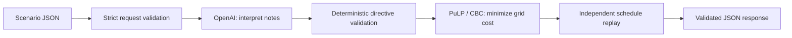

# bup-cse-preliminary-round — GridWise

A FastAPI service for the **BUP CSE Fest 2026 Smart Campus Energy Optimization Challenge**. The configured OpenAI model interprets operator notes, deterministic guardrails validate the result, PuLP/CBC minimizes 24-hour grid cost, and an independent validator replays the final schedule before it is returned.

**Verification status:** 165 tests passed inside Linux Docker; all 10 official sample optimal costs match. Real OpenAI requests through the container passed **30/30 with caching disabled, p95 3.667 seconds**. Astra and Terra also passed 15/15 supplemental paraphrase/adversarial checks each. A narrated 2:44 solution video and an exported Docker image are prepared locally. The GHCR image is anonymously pullable. The public Render API passed **30/30 uncached official requests, p95 2.642 seconds, maximum 3.380 seconds**. See [current next steps](docs/NEXT_STEPS.md). See [verification evidence](docs/VERIFICATION.md), [measured model performance](docs/PERFORMANCE.md), and [remaining deployment steps](docs/DEPLOYMENT.md). These results are not a claimed hidden-judge score.

## Judge audit and version 1.0.1 candidate

See the [criterion-by-criterion audit](docs/JUDGE_AUDIT.md), [measured candidate results](docs/audit-verification.json), and [verified 1.0.1 image/run instructions](docs/RELEASE_1_0_1.md). Version 1.0.1 keeps every official minimum electricity cost and adds a second LP that minimizes peak import at the same cost: SAMPLE-01 improves from 187.5 to 175 kWh; SAMPLE-09 from 187 to 170 kWh. It also adds one bounded transient-provider retry and stronger independent optimization tests.

The candidate passed **243 Windows and Linux container tests**, **30/30 uncached real Terra/low HTTP requests, p95 2.673 seconds**, and all ten official cases with up to eight concurrent requests. Terra none/low and Sol low each passed **56/56** additional live language audit requests. These are finite observations, not a hidden-score guarantee.

The local Compose service uses 1.0.1 with `OPENAI_MODEL=gpt-5.6-terra`, `OPENAI_REASONING_EFFORT=low`, and cache 128. The existing public service remains the verified 1.0.0/Terra-none deployment while the competition deadline/update policy is clarified. The PDFs state 11 PM; the user reported 10 PM, and the applicable date/update rules are unresolved. Do not label the candidate benchmark as hosted 1.0.1 evidence.

## Public service

Base URL: https://bup-cse-preliminary-round-1-0-0.onrender.com

- [Health](https://bup-cse-preliminary-round-1-0-0.onrender.com/health)
- [Interactive API documentation](https://bup-cse-preliminary-round-1-0-0.onrender.com/docs)
- Optimization: `POST /optimize-energy` with an official case input

The service uses Terra/none; normal interpretation cache size is 128. No authentication is required for the judge endpoints. The existing 1.0.0 image remains the tested deployment; later diagnostic logging changes are tracked separately.

## Official sources and API permission

The [main problem statement](docs/reference/main_prblm-1.pdf) defines behavior and schemas. The [participant guide and rubric](docs/reference/BUP_CSE_FEST_2026_Participant_Guide__Evaluation_Rubric_GridWise_LLM.pdf) defines scoring, deployment, and submission. The guide, section 04, page 5 explicitly permits **external model APIs or local models**, so OpenAI is allowed. It requires the language model to produce the operator-note interpretation used by the optimizer; phrase matching alone or an AI-written summary is insufficient.

The default model is `gpt-6-astra`, using the OpenAI **Responses API with Structured Outputs**, supported by the [official model documentation](https://developers.openai.com/api/docs/models/gpt-6-astra) and [Structured Outputs guide](https://developers.openai.com/api/docs/guides/structured-outputs). Your account must have access, funded quota, and adequate rate limits during judging.

The benchmark-selected **lower-latency profile** is `OPENAI_MODEL=gpt-5.6-terra` with `OPENAI_REASONING_EFFORT=none`. Set both variables together to use it. The original Astra/low default remains available as the documented baseline. This profile change affects language interpretation only; optimization and all validators are unchanged.

The root [official sample pack](BUP_CSE_FEST_2026_Preli_Public_Sample_Cases.json) is a byte-for-byte copy of the supplied organizer file, with 10 cases under `cases`. Each contains `input`, `expected_output`, and supporting metadata. Its SHA-256 is:

```text
fa6abd71868e0faf429a87429d7d4a2b7bfd38c5551565637498d7fec68d5f32
```

The service never loads reference interpretations or schedules. They are used only by tests and the explicitly labeled offline evaluation command. Do not edit the official file.

## Clean local quickstart

Install **Python 3.11 or later**; Python 3.12 is the tested version. CBC is included in the pinned PuLP distribution on supported platforms. No database or separate model server is needed.

```bash
git clone https://github.com/myshphew/BUP-CSE-FEST-2026-Hackathon-preliminary-round.git bup-cse-preliminary-round
cd bup-cse-preliminary-round
python -m venv .venv
```

Activate the environment:

```powershell
# Windows PowerShell; use py -3.12 instead of python above if your default is older.
.\.venv\Scripts\Activate.ps1
```

```bash
# Linux / macOS
source .venv/bin/activate
```

Then install exact runtime versions and development tests:

```bash
python -m pip install -r requirements.lock -r requirements-dev.txt
```

Copy `.env.example` to `.env` (`Copy-Item .env.example .env` in PowerShell; `cp .env.example .env` in Bash). Set `OPENAI_API_KEY` in that local file. Keep the key out of source control, screenshots, terminal output, and public submission fields. All other settings have working defaults.

```bash
python -m pytest -q
python -m scripts.evaluate_samples --offline
python run.py
```

The launcher binds `0.0.0.0:8000`, or the port supplied by `PORT`. Equivalent explicit command:

```bash
python -m uvicorn main:app --host 0.0.0.0 --port 8000 --no-access-log
```

In another terminal with the virtual environment activated:

```bash
curl http://127.0.0.1:8000/health
python -m scripts.extract_sample --index 1
curl -X POST http://127.0.0.1:8000/optimize-energy -H "Content-Type: application/json" --data-binary "@output/request.json"
python -m scripts.evaluate_samples --url http://127.0.0.1:8000 --limit 1
python -m scripts.evaluate_samples --url http://127.0.0.1:8000 --output output/live-samples.json
```

On Windows use `curl.exe` if PowerShell aliases `curl`. The extraction command copies the first **existing official** input to `output/request.json` and its complete reference response to `output/reference-response.json`; it does not generate scenarios. The ready health response is `{"status":"ok"}`. SAMPLE-01 should return a replay-valid 24-hour plan with `total_cost_bdt = 38365` within 0.01 BDT. Exact battery actions and peak grid may differ between equally optimal solutions.

`/health` verifies that a client is configured and the local solver passed a startup solve. It makes no paid provider call and cannot establish that a key has funded quota or model access. Missing credentials or an unavailable CBC produce controlled HTTP 500 with `service_not_ready`. **A successful full sample request is necessary before declaring a deployment ready for judging.**

## Where the LLM is needed, step by step

1. `main.py` accepts and strictly validates the scenario: 24 distinct hours, 1–3 non-empty notes, finite non-negative numeric values, and consistent battery bounds.
2. `interpreter.py` sends all notes and battery reference values in **one** OpenAI request. It extracts only note indexes, directive types, affected hours, and values. Percentage reserves can use the supplied battery capacity. Notes are user data, never system instructions. The model has no tools, credentials in its prompt, or execution path.
3. `validator.py` validates this compact untrusted extraction, derives `applies` and short explanations deterministically, then revalidates the exact public response shape and scenario-dependent bounds. It rejects unknown types/fields, invalid hours, duplicate or missing note mappings, incorrect `applies` semantics, non-finite numbers, and reserves above capacity. Generating redundant fields in Python reduces model output tokens without removing any semantic checks.
4. `constraints.py` combines overlapping instructions deterministically: multiply solar factors, maximize reserves, minimize grid caps, and zero prohibited charge/discharge limits.
5. `optimizer.py` builds and solves the linear program with CBC. **All schedules, costs, battery states, and grid totals come from deterministic code.** No LLM call is made here.
6. `schedule_validator.py` independently rebuilds the directive effects and replays each hour. It verifies energy balance, solar usage, battery transitions and bounds, rates, windows, grid caps, final neutrality, and recomputed totals.
7. `main.py` returns the exact response schema and a deterministic summary. Provider or validation failure returns a controlled error; it never substitutes `no_op` or serves a reference answer.



This is a single service with separate responsibilities. See [the mathematical formulation and implementation decisions](docs/ARCHITECTURE.md) and [the rubric mapping](docs/RUBRIC.md).

## API contract

- `GET /health`: HTTP 200 with `{"status":"ok"}` when configured and the solver is usable.
- `POST /optimize-energy`: one scenario object, exactly as `cases[i].input` in the official JSON. Do not send the whole sample pack or the case wrapper.
- Success: HTTP 200 with `scenario_id`, `directive_interpretation`, `hourly_plan`, `total_grid_kwh`, `total_cost_bdt`, `peak_grid_kwh`, and `plan_summary`.
- Malformed JSON or an invalid request: HTTP 400. Extra fields and strings/booleans in numeric fields are rejected. Input hours may arrive out of order; responses are always ordered 0–23.
- Infeasible validated constraints: HTTP 422. Feasible organizer scoring cases should never need this path under their correct interpretation.
- Model refusal, incomplete/malformed model output, upstream failure, solver failure, timeout, or failed replay: controlled HTTP 500. Error bodies contain only a fixed code/message, for example `{"error":{"code":"model_unavailable","message":"The language model is unavailable. Please retry later."}}`.

Interactive schema documentation is available at `/docs`. Absolute verification tolerance is **0.01 kWh / 0.01 BDT**, as specified. Required response numeric values remain finite and non-negative; totals are recomputed from the returned flows without rounding to display precision.

## Configuration

| Variable | Default | Purpose |
|---|---|---|
| `OPENAI_API_KEY` | required | Secret for the hosted API; never committed |
| `OPENAI_MODEL` | `gpt-6-astra` | Documented production model; any override needs its own compatibility and accuracy evaluation |
| `OPENAI_REASONING_EFFORT` | `low` | Astra: low, medium, high, xhigh, max. Sol/Terra also support `none`; Astra with `none` is rejected locally |
| `OPENAI_TIMEOUT_SECONDS` | `20` | Hard wall-clock deadline around the model call |
| `OPENAI_MAX_OUTPUT_TOKENS` | `2048` | Budget for the short structured response, including reasoning |
| `REQUEST_TIMEOUT_SECONDS` | `28` | Request processing deadline, including semaphore queue time; must be below 30 |
| `SOLVER_TIMEOUT_SECONDS` | `3` | CBC solve time budget; only proven-optimal results are accepted |
| `MAX_CONCURRENT_REQUESTS` | `8` | Maximum active interpretation/optimization pipelines per worker |
| `INTERPRETATION_CACHE_SIZE` | `128` | Bounded cache of successful validated model responses; `0` disables it |
| `PORT` | `8000` | Port used by `python run.py` and Docker |

`.env` is loaded without overriding existing environment variables. Responses API uses `store=false` and SDK retries are disabled. Version 1.0.1 allows one short application-controlled retry for transient transport/rate/server failures, inside the original 20-second model deadline. Authentication, permission, missing-model, insufficient-quota, timeout, refusal and invalid-output errors still fail safely without retry. Invalid outputs and provider failures are never cached. Cache keys include the exact notes, battery context, prompt, model, and reasoning effort; every cache hit is validated again. Simultaneous identical cache misses share one model call; one client's cancellation does not cancel another's shared request. It is an in-memory cache populated only by actual successful model responses, not a public-case lookup.

Use `INTERPRETATION_CACHE_SIZE=128` in normal operation and `0` for uncached latency measurements. Restart the service after editing `.env`; an already-running process retains its startup settings. Caching accelerates repeated notes with identical battery context, but does not make the first unseen note faster.

## Testing and performance

```bash
python -m pytest -q
python -m scripts.evaluate_samples --offline --output output/offline-samples.json
python tests/live_http_smoke.py
python -m pip check
```

Offline evaluation tests math under organizer interpretations. The HTTP smoke script starts real Uvicorn processes, verifies missing-key failure in the production app, and injects official expected interpretations into a **test-only** app to exercise all public cases over sockets. Neither command measures actual language understanding.

For actual LLM accuracy and latency, configure the key, run the production app, disable the interpretation cache for a cold-request benchmark, and run:

```bash
python -m scripts.evaluate_samples --url http://127.0.0.1:8000 --repeat 3 --output output/live-benchmark.json
```

The runner checks interpretation semantics, replays schedules under **organizer ground truth**, compares recalculated cost, and reports nearest-rank p95. Free-text explanations and exact optimal action sequences are not compared. The guide requires every request within 30 seconds and awards full latency credit at p95 <= 5 seconds. Local solver/mock timings do not establish hosted-model p95. Benchmark quota/rate limits and paraphrase accuracy before submitting.

Compare the configured API account's real model behavior without changing `.env` or restarting your existing server:

```bash
python -m scripts.benchmark_models --repeat 3 --output output/model-comparison.json
python -m scripts.benchmark_models --candidate gpt-6-astra:low --candidate gpt-5.6-terra:none --language-checks --repeat 1 --output output/language-checks.json
python -m scripts.verify_live_http --candidate gpt-5.6-terra:none --repeat 3 --output output/terra-http-benchmark.json
```

These commands make paid OpenAI calls with application caching forced off. The first two run the production FastAPI pipeline in-process. The default comparison tests Astra/low, Sol/none, and Terra/none in rotating order against the unchanged official pack. The second command uses explicitly labeled supplemental paraphrases and instruction-injection variants of those cases; it never changes the official JSON and is not used by production. The final command launches an isolated temporary Uvicorn server and verifies real HTTP latency, then stops it; it does not disturb your running server or edit `.env`. Results and the model decision are documented in [performance verification](docs/PERFORMANCE.md).

Tests also include isolated invalid-input mutations, overlapping directives, zero capacity/rates/tariffs, surplus solar, fractional values, infeasibility, independent dynamic-programming optimality checks, model refusal/timeouts/rate limits, prompt/data separation, corrupted schedules, deterministic repeat solves, and concurrent requests. Unit variants are explicitly test-only and never alter the official sample pack.

## Docker and deployment

The verified Linux/amd64 image uses Python 3.12, pinned runtime dependencies, an unprivileged user (UID 10001), a health check, and port 8000. Secrets are excluded from the build context. Docker Desktop's earlier Windows prerequisite issue is resolved; the [Windows troubleshooting notes](docs/DOCKER_WINDOWS.md) remain available if needed. With `.env` configured, the restartable local service can be managed using:

```bash
docker compose up -d --build --wait
docker compose ps
curl http://127.0.0.1:8000/health
docker compose logs --tail 30
docker compose down
```

Compose uses the model/cache values in `.env`, bounded log rotation, and `restart: unless-stopped`. Docker Desktop must itself be running. After changing `.env`, use `docker compose up -d --force-recreate --wait`. If port 8000 is occupied, set `HOST_PORT=8001` in the shell before starting Compose and use that port in local requests. Direct Docker commands are also supported:

```bash
docker build -t bup-cse-preliminary-round:1.0.1 .
docker run --rm bup-cse-preliminary-round:1.0.1 python -m scripts.evaluate_samples --offline
docker run --rm --name gridwise -p 8000:8000 --env-file .env bup-cse-preliminary-round:1.0.1
```

Run the health and full sample HTTP commands above. Do not substitute the test fixture app for `main:app` or `run.py` in a deployment.

### Exact published fallback (current public service, version 1.0.0)

From a directory containing your privately configured `.env`, pull and run the tested immutable image:

```bash
docker pull ghcr.io/myshphew/bup-cse-preliminary-round@sha256:262f30a45145c18310a61c34d4f7483b81dd7bb7293d81045938707c06b1d20f
docker run --rm --name gridwise -p 8000:8000 --env-file .env -e OPENAI_MODEL=gpt-5.6-terra -e OPENAI_REASONING_EFFORT=none -e PORT=8000 ghcr.io/myshphew/bup-cse-preliminary-round@sha256:262f30a45145c18310a61c34d4f7483b81dd7bb7293d81045938707c06b1d20f
```

In another terminal (use `curl.exe` on Windows):

```bash
curl http://127.0.0.1:8000/health
docker exec gridwise python -m scripts.evaluate_samples --url http://127.0.0.1:8000 --limit 1
```

The included official sample is used by that explicit verification command; the production API does not load it. Expected SAMPLE-01 cost: **38,365 BDT**. If port 8000 is occupied, change the left port to 8001 and use 8001 for the host health request; the `docker exec` command still uses the container's port 8000. The required credential is `OPENAI_API_KEY`, supplied only at runtime. Judge credentials must be provided through an organizer-approved private channel if required, never published in the repository.

Publish to your own registry after testing; the following is a **template**, not an existing published image. Replace `YOUR_NAMESPACE` with the authenticated registry owner and record the actual immutable digest in your submission:

```bash
docker tag bup-cse-preliminary-round:1.0.0 ghcr.io/YOUR_NAMESPACE/bup-cse-preliminary-round:1.0.0
docker push ghcr.io/YOUR_NAMESPACE/bup-cse-preliminary-round:1.0.0
docker pull ghcr.io/YOUR_NAMESPACE/bup-cse-preliminary-round:1.0.0
docker run --rm -p 8000:8000 --env-file .env ghcr.io/YOUR_NAMESPACE/bup-cse-preliminary-round:1.0.0
```

The optional **Publish tested Docker image** GitHub Actions workflow publishes to GHCR using GitHub's job token after tests, offline container verification, and a readiness check pass. It records the exact digest and verifies an authenticated registry pull. The package owner must separately enable and verify anonymous pulls for judges. See [the publication runbook](docs/DEPLOYMENT.md); this workflow was pushed and [ran successfully](https://github.com/myshphew/BUP-CSE-FEST-2026-Hackathon-preliminary-round/actions/runs/35364973349). Anonymous pulls and execution of the published digest have passed.

Deploy the same image on a publicly reachable platform with `OPENAI_API_KEY` supplied through its secret manager. Keep both judge endpoints accessible without a login, VPN, or manual action. Verify both endpoints **from outside the development machine** and keep the service and image available throughout evaluation. The existing [GitHub CI run for commit c9f0040 passed](https://github.com/myshphew/BUP-CSE-FEST-2026-Hackathon-preliminary-round/actions/runs/35361197350).

The guide also requires repository visibility/timing rules and a maximum three-minute solution video. See [the submission checklist](docs/SUBMISSION.md) and [video transcript/reproduction notes](docs/video/README.md). The local video is `output/submission/gridwise-solution.mp4`; the image archive is `output/submission/gridwise-1.0.0.tar`, with SHA-256 checksums beside them. These generated artifacts are intentionally outside Git. The GHCR image is published, and the video is uploaded to a private draft release. The public API and anonymous image access are verified; final organizer submission and public repository/video access remain. See [current next steps](docs/NEXT_STEPS.md).

## Dependencies, attribution, and limitations

Python; FastAPI/Starlette; Uvicorn; Pydantic; the OpenAI Python SDK and Responses API; PuLP and its bundled COIN-OR CBC solver; python-dotenv; HTTPX; and pytest are credited external tools. Transitive dependencies are recorded in `requirements.lock`. OpenAI Codex assisted implementation and verification; the team should review and understand the code before submitting.

- The lossless battery, hourly intervals, no-export rule, and terminal neutrality follow the challenge, not a real-world battery degradation/efficiency model.
- Deterministic guardrails verify shapes and numeric/physical consistency. They cannot prove that a valid-looking interpretation matches the natural-language intent. That requires live language evaluation against expected semantics.
- LLM behavior and provider latency are not deterministic. The scheduling calculation is deterministic for the same validated inputs and pinned runtime. Equivalent optimal schedules can differ across solver versions/platforms.
- Missing keys, inaccessible models, insufficient quota, or invalid model outputs fail safely; there is no heuristic interpreter fallback. A correct but slow/unavailable provider can still lose rubric points.
- The public API passed all 30 uncached official requests; see [hosted verification](docs/public-verification.json). Render Free sleeps after 15 idle minutes and can take about a minute to wake, so these warm-instance results do not guarantee cold-start availability. Final organizer submission and public repository/video access remain. Hidden-note accuracy is not established by public samples.
- The installed test dependencies emit two upstream deprecation warnings; the test suite still passes. They concern Starlette's HTTPX test client and AnyIO's portal alias.
